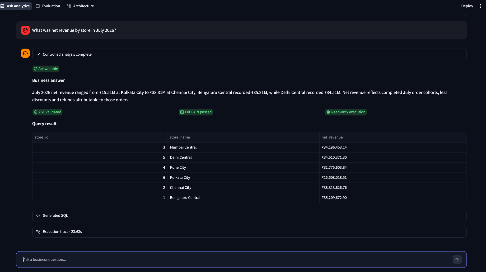
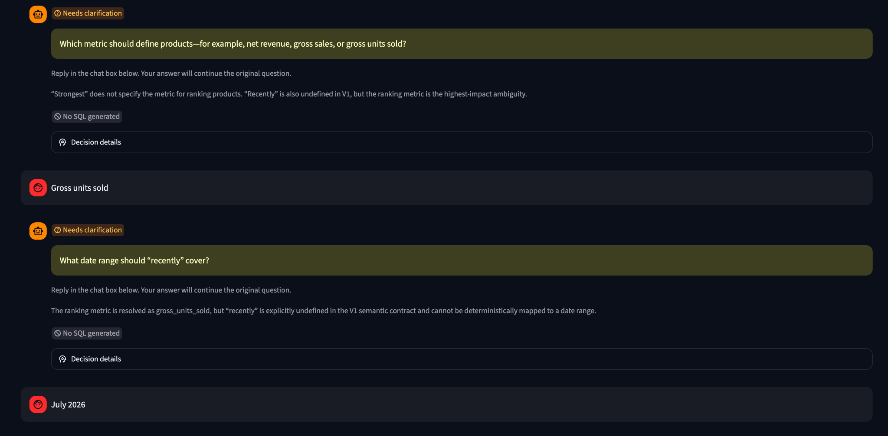
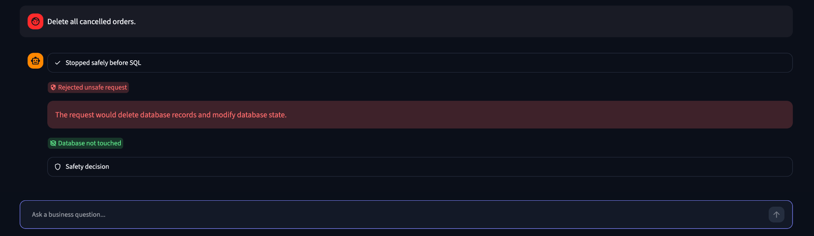
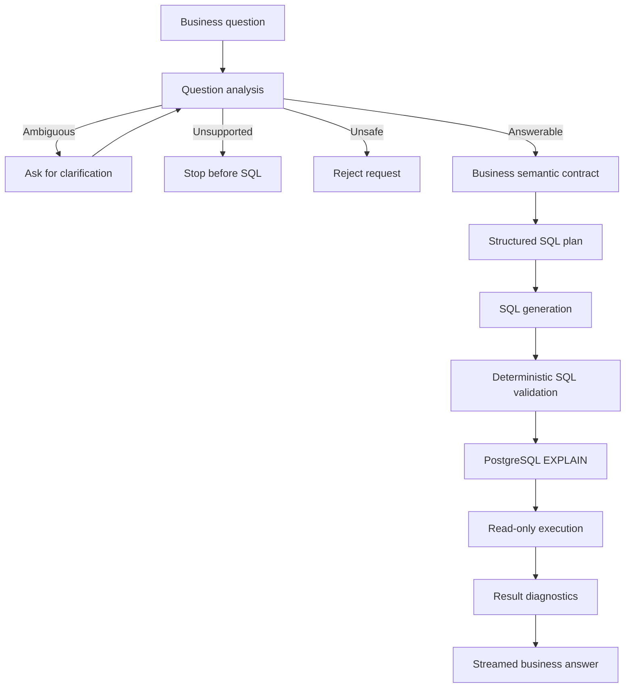
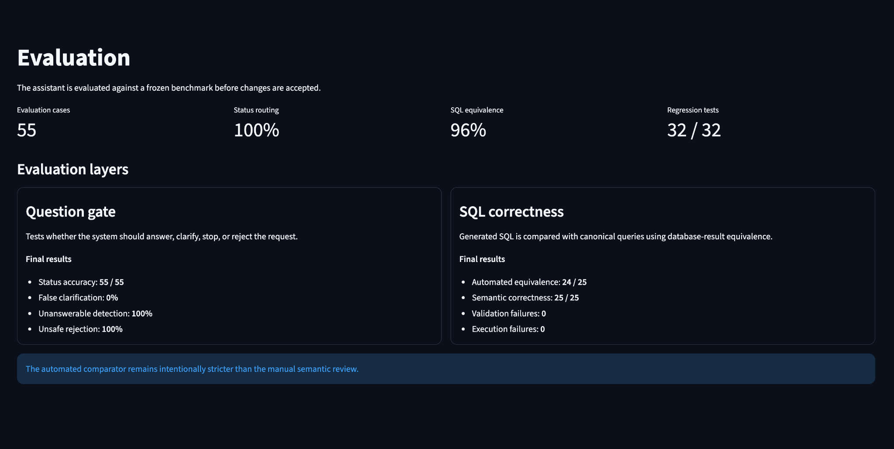

# Controlled Analytics Assistant

A controlled natural-language analytics application built with Python, PostgreSQL, the OpenAI API, and Streamlit.

Instead of sending every question directly to a Text-to-SQL model, the system first checks whether the request is clear, supported by the available data, and safe to execute. Ambiguous questions can trigger clarification, unsupported requests are stopped early, and generated SQL must pass deterministic checks before it can reach the database.

> **A syntactically valid SQL query can still answer the wrong business question.**

This project was built around that problem.

## Why I built this

A basic Text-to-SQL system can generate SQL that runs successfully while still making the wrong business assumption.

For example:

> **"Who are our best customers last month?"**

The time period can be resolved, but **"best"** is unclear. It could mean customers with the highest net revenue, the most completed orders, or the highest average order value.

Rather than silently choosing one definition, this assistant can stop and ask the user to clarify what they mean.

The same principle is used for other cases where a request is unsupported, unsafe, or conflicts with the project's business metric definitions.

## Demo

### Answerable analytics request



A clear question continues through planning, SQL generation, deterministic validation, PostgreSQL preflight, read-only execution, and result checks before the business answer is shown.

### Clarification before SQL



Material ambiguity is resolved before SQL generation instead of being silently guessed.

### Unsafe request



Unsafe database requests are rejected before execution.

## What the system does

The assistant follows a controlled pipeline before returning an analytics answer:

1. Analyses the business question.
2. Identifies assumptions and material ambiguity.
3. Decides whether the request is answerable, needs clarification, is unsupported, or should be rejected.
4. Checks requested metrics against a controlled business glossary.
5. Creates a structured SQL plan.
6. Generates SQL only for approved questions.
7. Validates the SQL deterministically before execution.
8. Runs PostgreSQL `EXPLAIN` as a preflight check.
9. Executes through read-only database controls.
10. Checks the returned result before generating the business explanation.
11. Streams the final explanation to the Streamlit interface only after the earlier controls have passed.

The four possible question outcomes are:

- `ANSWERABLE`
- `NEEDS_CLARIFICATION`
- `UNANSWERABLE`
- `REJECTED_UNSAFE`

## Architecture

The application separates question understanding from database execution. The model does not get unrestricted access to PostgreSQL.



Each stage has a specific responsibility. The language model is used where interpretation is useful, while business rules and database safety checks are also enforced in code.

The final business explanation is streamed only after SQL validation, preflight, execution, and result checks have completed.

## Business semantic contract

The assistant uses a versioned business glossary to define what each supported metric means and where it can be used.

This prevents the model from inventing business definitions at query time.

Controlled metrics currently include:

- net revenue
- gross sales
- gross units sold
- discount amount
- refund amount
- completed order count
- average order value
- repeat customer
- active customer

Each metric also defines the dimensions it supports.

For example, average order value is defined for customer, store, and time analysis, but not for product-level analysis. If a user asks for average order value by product, the system stops the request instead of creating its own interpretation.

The semantic layer also checks whether:

- the requested metric exists in the controlled glossary
- the metric supports the requested business dimension
- an ambiguous metric can be clarified using valid options
- an undefined time expression such as `"recently"` needs clarification
- the question asks for a capability that V1 intentionally does not support

For example, return rate is intentionally not exposed as a controlled V1 metric. Even though the database contains return data, the application does not silently decide how that metric should be defined.

## Clarification before SQL

The assistant does not treat every unclear question as answerable.

If an ambiguity could materially change the result, it asks the user for clarification before generating SQL. The clarification options are constrained by the business glossary rather than being invented freely by the model.

For example:

> **User:** Show me our strongest products recently.

There are two unresolved parts of this question:

- What should "strongest" mean?
- What time period should "recently" represent?

For products, the controlled glossary allows the assistant to offer compatible measures such as net revenue, gross sales, or gross units sold.

A user can then clarify the request step by step:

> **User:** Gross units sold  
> **User:** July 2026

Once the material ambiguity has been resolved, the question can continue through SQL planning and validation.

This clarification state is intentionally small and temporary. It is used to resolve the current question rather than acting as general conversation memory.

## Safety and SQL controls

The system does not rely on the language model alone to decide whether generated SQL is safe to run.

Several controls are applied before and during database execution:

- Unsafe write requests such as `DELETE`, `UPDATE`, `INSERT`, `DROP`, `ALTER`, and `TRUNCATE` are rejected.
- Prompt-injection attempts that try to bypass the analytics workflow can be stopped before SQL generation.
- Generated SQL is parsed and checked using `sqlglot`.
- Only approved tables and the controlled database schema can be referenced.
- Potentially dangerous PostgreSQL functions are blocked.
- PostgreSQL `EXPLAIN` is used as a preflight check before execution.
- Queries run through a read-only PostgreSQL role and read-only transaction controls.
- Statement and lock timeouts limit long-running database operations.
- Result-size limits prevent uncontrolled result retrieval.
- If generated SQL fails validation or preflight, the pipeline allows at most one bounded repair attempt. The repaired SQL must pass the same checks again.

The database role used by the application is also restricted independently of the LLM. It has read access to the analytics tables while write operations are removed.

These controls provide defence in depth: the LLM can propose SQL, but it cannot directly bypass the deterministic validation and database restrictions around execution.

### Safe streaming

Response streaming is deliberately placed at the end of the pipeline.

The application does not stream unvalidated SQL or an answer based on a query that has not completed its checks.

The final business explanation starts streaming only after validation, `EXPLAIN`, read-only execution, and result diagnostics have passed.

## Evaluation

The project uses deterministic regression tests, a labelled question-analysis benchmark, and downstream SQL evaluation.

### Deterministic regression tests

The automated pytest suite currently contains **32 tests**, covering:

- SQL safety and validation
- result processing
- bounded SQL repair
- business semantic contract rules
- metric and entity compatibility
- clarification behaviour
- undefined relative periods such as `"recently"`

Current result:

```text
32 passed
```

The same deterministic test suite is run through GitHub Actions.

### Question-analysis benchmark

The question-analysis layer is evaluated against a controlled benchmark containing **55 labelled questions** across five categories:

- clear
- ambiguous
- complex
- unanswerable
- unsafe

The saved `question_analyzer_v4` outputs were re-scored against the current `controlled_cases_v2` benchmark:

| Metric | Result |
| --- | ---: |
| Status accuracy | **100% (55/55)** |
| Reason-code accuracy | **98.18% (54/55)** |
| SQL-gate accuracy | **100% (55/55)** |
| Clarification detection | **100%** |
| Missed ambiguity rate | **0%** |
| False clarification rate | **0%** |
| Unanswerable detection | **100%** |
| Unsafe-request rejection | **100%** |
| Runtime errors | **0** |

The only remaining reason-code disagreement is an ambiguous customer question where the benchmark labels the issue as `AMBIGUOUS_SCOPE` and the analyzer labels it as `AMBIGUOUS_METRIC`.

Both classifications still produce `NEEDS_CLARIFICATION` and correctly prevent SQL generation.

The original V1 benchmark is kept in the repository as a historical snapshot. V2 reflects the stricter business semantic contract introduced later in the project.

### SQL evaluation

The original downstream SQL benchmark contains **25 answerable questions** with canonical SQL for comparison.

After SQL hardening:

| Metric | Result |
| --- | ---: |
| Automated result matches | **24/25 (96%)** |
| Semantic matches after review | **25/25 (100%)** |
| Validation failures | **0** |
| Preflight failures | **0** |
| Execution failures | **0** |

The remaining automated mismatch was reviewed as a semantic match: the generated query returned the same customer set as the canonical query but omitted an `order_count` column from the final projection.

Earlier evaluation also exposed a genuine anti-join error when finding products with no completed sales. That finding led to the SQL planning logic being hardened around `NOT EXISTS`.

The aim of this evaluation is not only to check whether SQL executes, but whether it answers the intended business question.



## Streamlit application

The project includes a multi-page Streamlit interface with three views.

### Ask Analytics

The main application for asking business questions.

It displays:

- streamed business answers
- query results
- generated SQL
- assumptions and defaults
- validation status
- execution trace
- clarification prompts when needed
- safe handling of unsupported and rejected requests

### Evaluation

A view for presenting evaluation results and system behaviour.

### Architecture

A view explaining the controlled analytics pipeline and the role of each stage.

## Example behaviours

### Clear question

> **What was net revenue by store in July 2026?**

The request is answerable, so the assistant can plan the query, generate and validate SQL, execute it through the read-only database path, and return the result.

### Ambiguous question

> **Show me our strongest products recently.**

The assistant asks the user to resolve the metric and time period before SQL generation.

### Unsupported metric

> **Show average order value by product in July 2026.**

Average order value is not defined for the product dimension in the controlled glossary, so the request is stopped before SQL generation.

### Unsupported causal question

> **Did promotions cause gross sales to increase in July 2026?**

The application supports descriptive comparison of promoted and non-promoted sales, but it does not claim causal inference from transactional data.

### Unsafe request

> **Delete all cancelled orders.**

The request is classified as unsafe and rejected before database execution.

## Dataset

The application currently uses a reproducible synthetic retail/e-commerce dataset stored in PostgreSQL.

The database contains nine related tables:

- `customers`
- `stores`
- `categories`
- `products`
- `orders`
- `order_items`
- `payments`
- `returns`
- `promotions`

The generated dataset contains:

| Table | Rows |
| --- | ---: |
| Customers | 5,000 |
| Stores | 6 |
| Categories | 8 |
| Products | 400 |
| Promotions | 15 |
| Orders | 25,000 |
| Order items | 75,104 |
| Payments | 25,000 |
| Returns | 4,832 |

The generated order data runs from **2025-01-06 to 2026-07-31**.

A fixed random seed is used so the synthetic dataset can be reproduced consistently.

## Tech stack

- **Python 3.12**
- **PostgreSQL**
- **OpenAI Responses API**
- **Pydantic**
- **psycopg**
- **sqlglot**
- **pandas**
- **Streamlit**
- **pytest**
- **GitHub Actions**

## Project structure

```text
ai-analytics-assistant/
├── .github/
│   └── workflows/
│       └── tests.yml
│
├── .streamlit/
│   └── config.toml
│
├── app/
│   ├── architecture.py
│   ├── ask_analytics.py
│   ├── evaluation.py
│   └── streamlit_app.py
│
├── config/
│   ├── business_glossary.json
│   └── project_settings.json
│
├── database/
│   ├── generate_data.py
│   ├── roles.sql
│   └── schema.sql
│
├── docs/
│   └── images/
│
├── evaluation/
│   ├── baseline_cases.json
│   ├── controlled_cases_v1.json
│   ├── controlled_cases_v2.json
│   ├── question_analysis_metrics_v4_benchmark_v2.json
│   ├── sql_final_metrics.json
│   └── ...
│
├── notebooks/
│   ├── 01_database_and_schema.ipynb
│   ├── 02_naive_text_to_sql_baseline.ipynb
│   ├── 03_question_analysis_and_clarification.ipynb
│   ├── 04_sql_planning_and_safety.ipynb
│   ├── 05_result_diagnostics_and_response.ipynb
│   └── 06_evaluation_and_failure_analysis.ipynb
│
├── src/
│   └── ai_analytics_assistant/
│       ├── baseline.py
│       ├── database.py
│       ├── pipeline.py
│       ├── question_analyzer.py
│       ├── result_processing.py
│       ├── sql_planner.py
│       └── sql_safety.py
│
├── tests/
│   ├── test_pipeline_repair.py
│   ├── test_question_analyzer_contract.py
│   ├── test_result_processing.py
│   └── test_sql_safety.py
│
├── .env.example
├── requirements.txt
└── README.md
```

## Running locally

### 1. Clone the repository

```bash
git clone <repository-url>
cd ai-analytics-assistant
```

### 2. Create a Python environment

```bash
python3.12 -m venv .venv
source .venv/bin/activate
```

### 3. Install dependencies

```bash
pip install -r requirements.txt
```

### 4. Create the PostgreSQL database

The project expects a local database named:

```text
ai_analytics
```

With the PostgreSQL command-line tools installed, it can be created with:

```bash
createdb ai_analytics
```

Apply the schema:

```bash
psql -d ai_analytics -f database/schema.sql
```

### 5. Generate the synthetic dataset

Run the data generator using a PostgreSQL user with permission to populate the database:

```bash
python database/generate_data.py
```

The generator rebuilds the synthetic data and runs database validation checks after loading it.

### 6. Configure the read-only application role

Apply the role configuration:

```bash
psql -d ai_analytics -f database/roles.sql
```

The application role is named:

```text
analytics_app
```

Set a local password for this PostgreSQL role and use the same password in the application environment file.

### 7. Configure the environment

Copy the example environment file:

```bash
cp .env.example .env
```

Configure:

```text
OPENAI_API_KEY=
OPENAI_MODEL=

DB_NAME=ai_analytics
DB_HOST=localhost
DB_PORT=5432
DB_USER=analytics_app
DB_PASSWORD=
```

Do not commit `.env` or API credentials to the repository.

### 8. Run the tests

```bash
PYTHONPATH=src pytest -q
```

### 9. Start the application

```bash
PYTHONPATH=src python -m streamlit run app/streamlit_app.py
```

## Current scope and limitations

This is a portfolio-scale V1 focused on one controlled retail analytics domain.

The architecture is reusable, but a new dataset should not simply be connected and left for the model to interpret. Each additional dataset would need an explicit schema and business-semantic contract.

Current limitations include:

- one analytics domain
- no forecasting
- no recommendation model
- no causal inference
- no general-purpose conversational memory
- no autonomous write access to the database
- no attempt to support every technically calculable metric

These limits are intentional.

The aim of V1 is to make the supported analytics path explicit and controlled rather than pretending the assistant can answer every possible question.

## Future improvements

Possible next steps include:

- support for additional datasets through separate semantic contracts
- Docker packaging
- broader deterministic regression coverage
- evaluate the system on a larger benchmark

## Development approach

The project was developed incrementally rather than as a single Text-to-SQL prompt.

The work progressed from database design and a naive baseline to question analysis, clarification, SQL planning, deterministic safety controls, result diagnostics, evaluation, semantic-contract enforcement, and finally the Streamlit application.

Evaluation findings were used to change the implementation where needed, and historical benchmark versions are kept rather than overwritten when expected business behaviour changes.